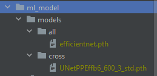

# Сервис обработки МРТ снимков

__РУЧКИ В SWAGGER БЕЗ ПРИПИСКИ API__

## Общая архитектура

Приведенная схема отражает список сервисов.

`docker`:
* 8080 - api-gateway
* 8080/docs - swagger
* 8081 - redpanda console (kafka, не накликайте ничего)
* 9000 - s3
    - log, pss: minioadmin:minioadmin
* 50050 - grpc auth service
* 50051 - grpc med service
* 50052 - grpc mri service

_psql db: authdb, meddb, mridb_. Создаются при инициализации docker volume. Миграции накатываются при запуске контейнера. __ПОРТ 5433__

__КАК ЗАПУСТИТЬ?__

0) добыть веса для нейронки и положить ml_service/ml_service/internal/ml_model/models/cross и all

1) docker compose --profile deps up -d
2) создать бакет в минио + access + secret key
    + зайти на localhost:9000
    + minioadmin:minioadmin
    + слева вкладке access keys
    + справа сверху `create access key` - вбиваем в него
        - access_key: `NZjt6KmuHQRU7IitYUiW`
        - secret_key: `ql9DoBMKyqMxQm8j5LQuKwnn68KFsGqn5jGbL7uL`
3) вкладка object browser, создаем бакет `mri`
4) создаем топики для redpanda (потом автоматизируем, сейчас я в __`тильте`__)
    + localhost:8081    
    + вкладка topics
    + создаем 3 топика:
        - mriupload
        - mrisplitted
        - mriprocessed
5) docker compose --profile app up -d

6) __ОПЦИОНАЛЬНО__ : каждый снимок МРТ должно быть привязанно к mri_device, нужно добавить это в бд шоб работало
    * pgAdmin/DataGrip/Расширение vscode для баз данных, заходите в mridb, таблица `device` добавляете что угодно, этот id потом юзаете при post /mri/mris, этот device_id

    Например, `INSERT INTO device VALUES (1, 1)`

Если не сносить docker volume's, то операции нужно будет делать всего 1 раз, потом можно поднимать все сразу с помощью `docker compose up -d`

_P.S.: Ключи можете поменять, тогда не забудьте прокинуть их в сервисы через .env-docker файлы/запускать контейнеры с своими env'арами. В коде никакие ключи гвоздями не прибиты (только bucket)_

`local`: 
+ go install github.com/go-task/task/v3/cmd/task@latest
+ go install google.golang.org/protobuf/cmd/protoc-gen-go@latest
+ go install google.golang.org/grpc/cmd/protoc-gen-go-grpc@latest
+ go install github.com/swaggo/swag/cmd/swag@latest
+ go install golang.org/x/tools/cmd/goimports@latest
+ go install mvdan.cc/gofumpt@latest
+ docker compose --profile deps up -d (поднимет s3, psql, redpanda)
+ task run в папках сервисов

Если перегенерите файлы в ml_service, добавьте в ml_api_pb2_grpc.py `from ml_service.api` (почему-то не добавляется автоматом, пока не разобрался)

## Эхографика
Пока в проекте эхографические признаки аналогично проекту УЗИ, потом список полей будет изменен

//TODO: в task'ах написать форматеры для sql + proto + go + smt..?
//TODO: подумать над решение задачи об общей /pkg для всех сервисов
//TODO: сделать так, что бы панда показывала proto сообщения